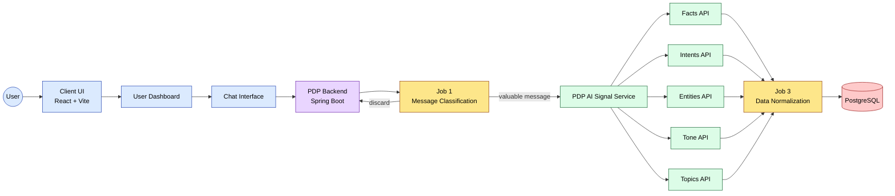
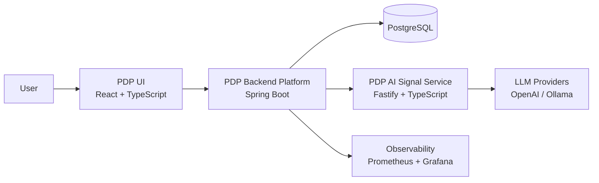
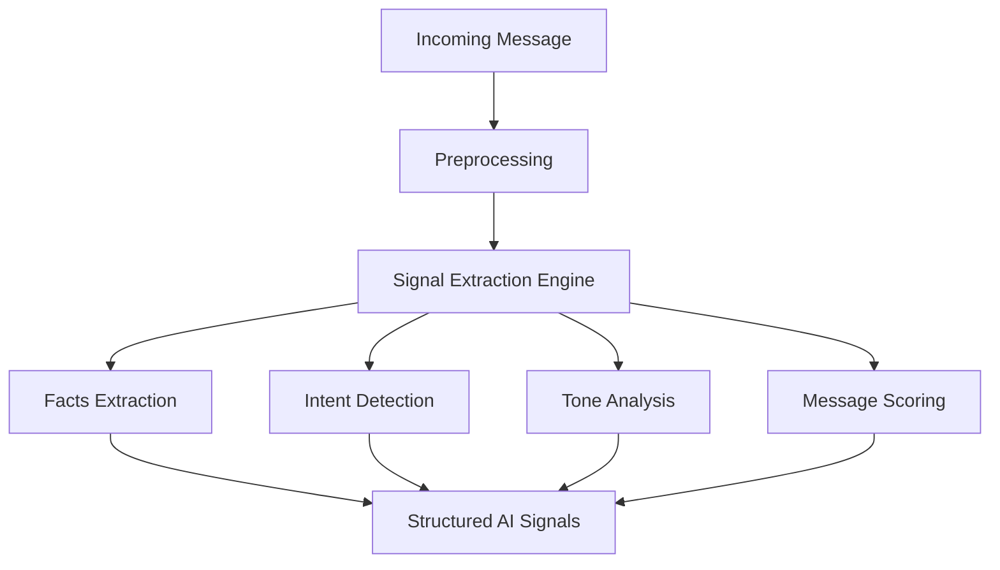

# Hi, I'm Yaser Noorollahi 👋

Backend Engineer focused on building AI-powered platforms, asynchronous processing pipelines, and production-grade backend systems.

I enjoy designing systems that combine clean architecture, distributed processing, observability, and AI-driven signal extraction.

Currently building a platform called Personal Data Platform (PDP).

---

# What I Build

I design backend systems that include:

- scalable REST APIs
- asynchronous processing pipelines
- AI-powered signal extraction
- distributed service architectures
- operational observability

Core stack:

Java • Spring Boot • PostgreSQL • Docker  
TypeScript • Fastify • React • Vite  
Prometheus • Grafana • Redis

---
## AI Processing Pipeline

# Featured Projects

## Personal Data Platform (PDP)

Production-style backend platform for secure user data management and AI-powered message understanding.

Core capabilities:

- JWT authentication with refresh token lifecycle
- role-based access control
- item lifecycle management
- asynchronous AI enrichment pipelines
- moderation workflows
- monitoring and observability

## System Architecture

### Architecture Overview

Client
  |
  v
REST Controllers
  |
  v
Domain Services
  |
  +-------------+
  |             |
  v             v
PostgreSQL    AI Signal Service
  |
  v
Observability Layer
(Prometheus + Grafana)

Key features:

- layered architecture
- event-driven domain flows
- async AI processing pipelines
- Flyway-managed database schema
- operational monitoring

Tech:

Java 21  
Spring Boot  
Spring Security  
PostgreSQL  
Docker  
Prometheus  
Grafana  

Repository:

https://github.com/yasernoorollahi/pdp

---

## PDP AI Signal Service

Stateless microservice responsible for extracting structured signals from text.

This service powers the AI pipeline of the PDP platform.

Capabilities:

- facts extraction
- intent detection
- tone analysis
- cognitive signal detection
- topic classification
- message usefulness scoring

## AI Signal Extraction Pipeline

### Service Architecture

Controller Layer
     |
     v
Extraction Services
     |
     v
AI Provider Adapters
(OpenAI / Ollama / Mock)
     |
     v
Structured Signal Output

Features:

- provider abstraction layer
- strict schema validation
- Zod-based output validation
- retry and timeout handling
- Swagger documentation

Tech:

TypeScript  
Fastify  
Zod  
OpenAI / Ollama  

Repository:

https://github.com/yasernoorollahi/pdp-ai-signals

---

## PDP UI

Frontend interface for interacting with the PDP backend platform.

Features:

- role-based dashboards
- chat interface for message ingestion
- admin moderation workflows
- system monitoring views

### Frontend Architecture

React App
   |
   v
Auth Context
   |
   v
Router + Role Guards
   |
   +----------------------+
   |                      |
User Dashboard       Admin Dashboard
   |                      |
Chat Interface       Moderation Tools

Tech:

React  
TypeScript  
Vite  
Axios  
React Router  

Repository:

https://github.com/yasernoorollahi/pdp-ui

---

# What I'm Exploring

Currently interested in:

- AI-assisted backend systems
- distributed data processing pipelines
- event-driven architectures
- observability-driven system design

---

# Open to Remote Opportunities

Interested in roles involving:

- backend platform engineering
- distributed backend systems
- AI-powered infrastructure
- data processing pipelines

Feel free to connect.
