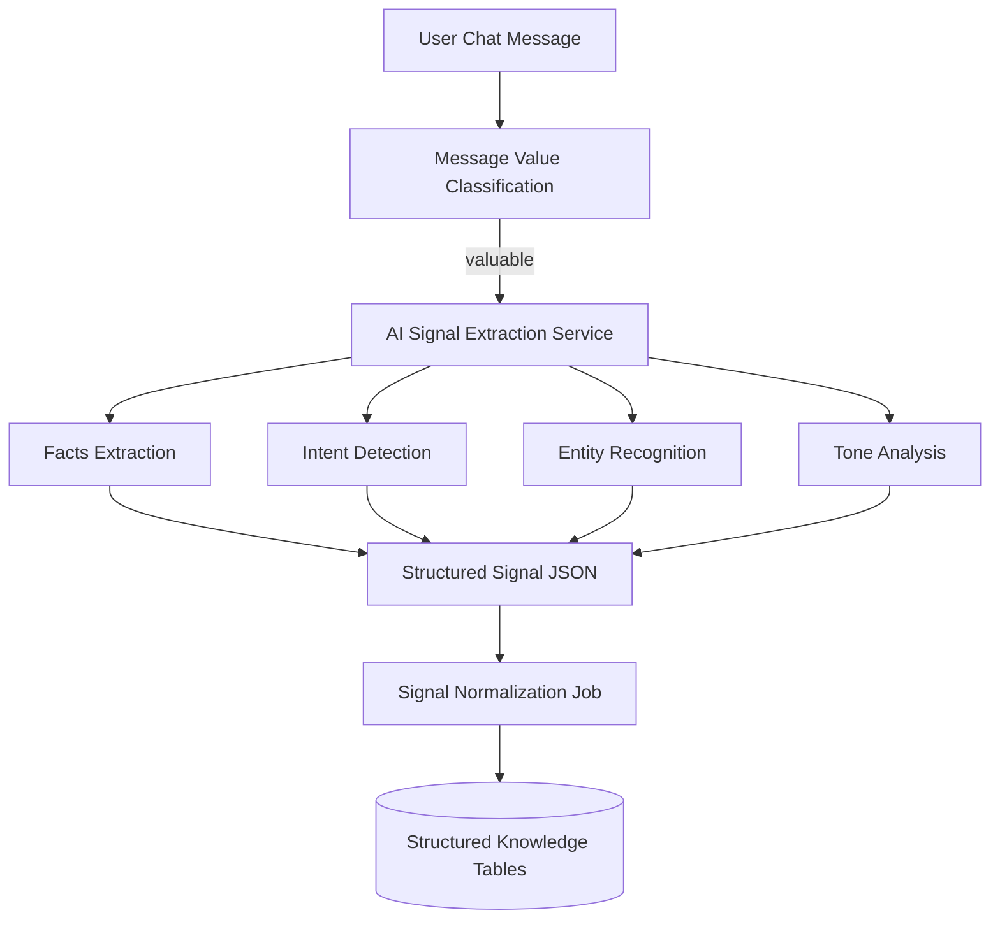
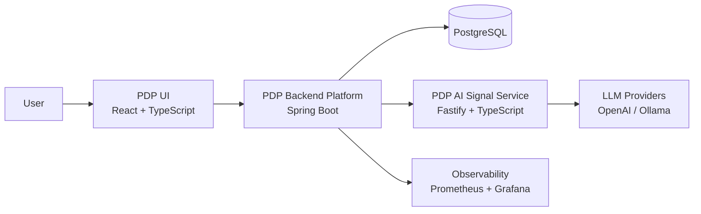
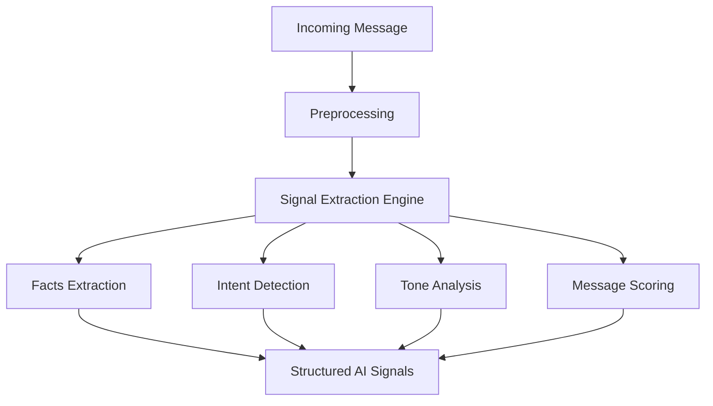

# Hi, I'm Yaser Noorollahi 👋

I’m an AI systems and backend platform engineer who designs and builds production-grade intelligent systems that combine backend services, large language models, and cloud-native infrastructure.

My work sits at the intersection of backend engineering, AI-powered processing, and platform infrastructure. I’m particularly interested in building systems that transform unstructured inputs into structured, actionable knowledge through multi-stage processing pipelines and domain-aware data models.

I enjoy working on problems that involve system architecture, data modeling, and asynchronous processing pipelines — not just building APIs. My approach is to start from the data flow and system behavior, then design the services, jobs, and storage layers around it to produce reliable and structured outcomes.

Technically I work across the stack required to build and operate these systems, including backend services, AI integrations, data pipelines, and production infrastructure. I also have experience working with Kubernetes platforms, observability stacks, and distributed system operations, which helps me design systems that are reliable, scalable, and observable in production.

I’m particularly interested in roles involving AI-powered data platforms, backend infrastructure, and intelligent data processing systems.

## 🚀 My Projects

🔥 Check out my repositories here:  
👉 https://github.com/yasernoorollahi?tab=repositories

## Engineering Case Study
A deep dive into the architecture and design decisions behind PDP.

👉 [Read the Engineering Case Study](https://github.com/yasernoorollahi/pdp/blob/main/docs/engineering-case-study.md)

---

# What I Build

I design backend systems that include:

- scalable REST APIs
- asynchronous processing pipelines
- AI-powered signal extraction
- distributed service architectures
- operational observability

Core stack:

Java • Spring Boot • PostgreSQL • Docker  
TypeScript • Fastify • React • Vite  
Prometheus • Grafana • Redis

---
## AI Signal Processing Pipeline

# Featured Projects

## Personal Data Platform (PDP)

Production-style backend platform for secure user data management and AI-powered message understanding.

Core capabilities:

- JWT authentication with refresh token lifecycle
- role-based access control
- item lifecycle management
- asynchronous AI enrichment pipelines
- moderation workflows
- monitoring and observability

## System Architecture

### Architecture Overview

Client
  |
  v
REST Controllers
  |
  v
Domain Services
  |
  +-------------+
  |             |
  v             v
PostgreSQL    AI Signal Service
  |
  v
Observability Layer
(Prometheus + Grafana)

Key features:

- layered architecture
- event-driven domain flows
- async AI processing pipelines
- Flyway-managed database schema
- operational monitoring

Tech:

Java 21  
Spring Boot  
Spring Security  
PostgreSQL  
Docker  
Prometheus  
Grafana  

Repository:

https://github.com/yasernoorollahi/pdp

---

## PDP AI Signal Service

Stateless microservice responsible for extracting structured signals from text.

This service powers the AI pipeline of the PDP platform.

Capabilities:

- facts extraction
- intent detection
- tone analysis
- cognitive signal detection
- topic classification
- message usefulness scoring

## AI Signal Extraction Pipeline

### Service Architecture

Controller Layer
     |
     v
Extraction Services
     |
     v
AI Provider Adapters
(OpenAI / Ollama / Mock)
     |
     v
Structured Signal Output

Features:

- provider abstraction layer
- strict schema validation
- Zod-based output validation
- retry and timeout handling
- Swagger documentation

Tech:

TypeScript  
Fastify  
Zod  
OpenAI / Ollama  

Repository:

https://github.com/yasernoorollahi/pdp-ai-signals

---

## PDP UI

Frontend interface for interacting with the PDP backend platform.

Features:

- role-based dashboards
- chat interface for message ingestion
- admin moderation workflows
- system monitoring views

### Frontend Architecture

React App
   |
   v
Auth Context
   |
   v
Router + Role Guards
   |
   +----------------------+
   |                      |
User Dashboard       Admin Dashboard
   |                      |
Chat Interface       Moderation Tools

Tech:

React  
TypeScript  
Vite  
Axios  
React Router  

Repository:

https://github.com/yasernoorollahi/pdp-ui

---

# What I'm Exploring

Currently interested in:

- AI-assisted backend systems
- distributed data processing pipelines
- event-driven architectures
- observability-driven system design

---

# Open to Remote Opportunities

Interested in roles involving:

- backend platform engineering
- distributed backend systems
- AI-powered infrastructure
- data processing pipelines

Feel free to connect.
